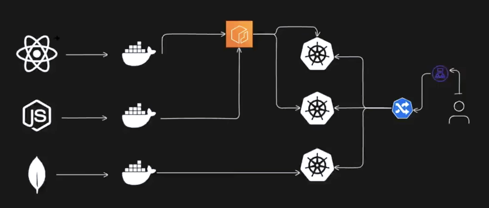
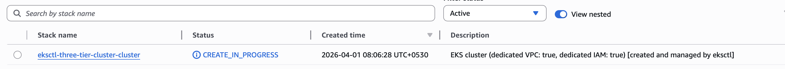
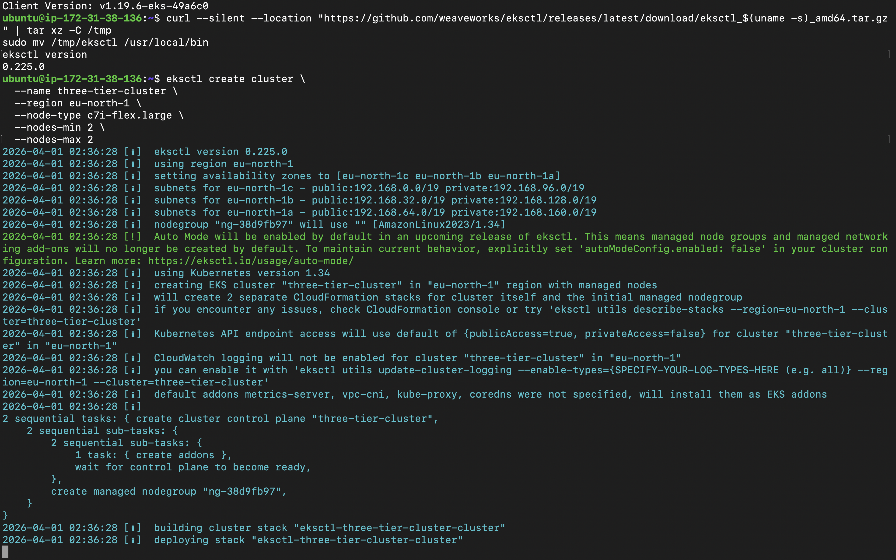
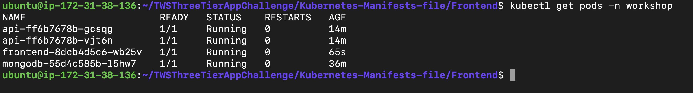
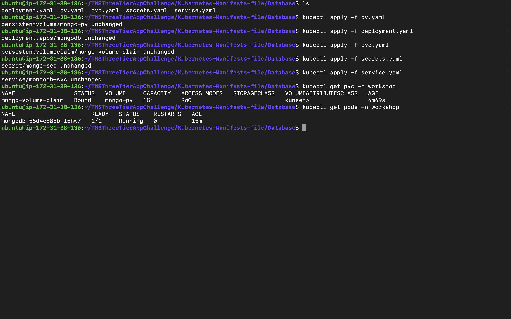
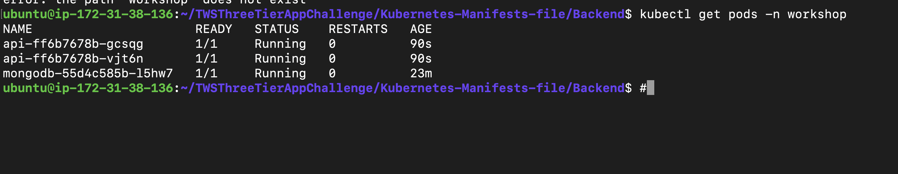
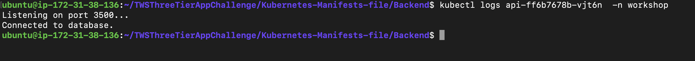
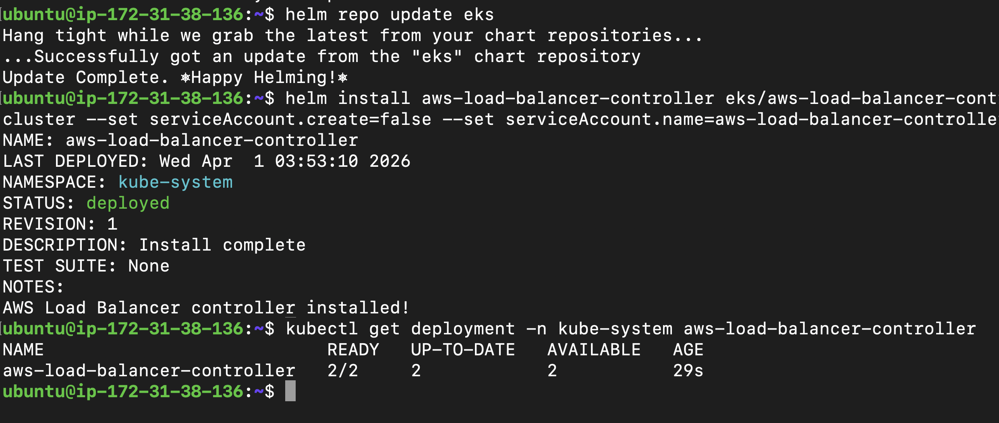
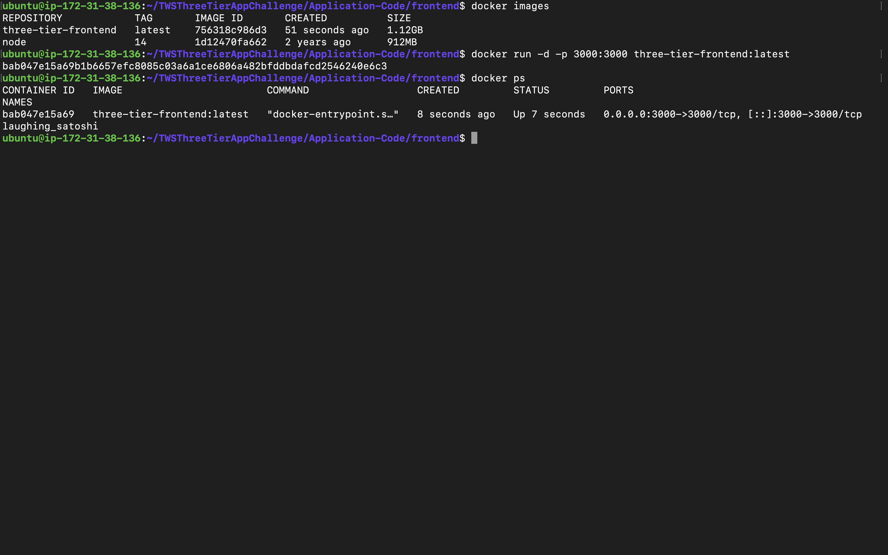
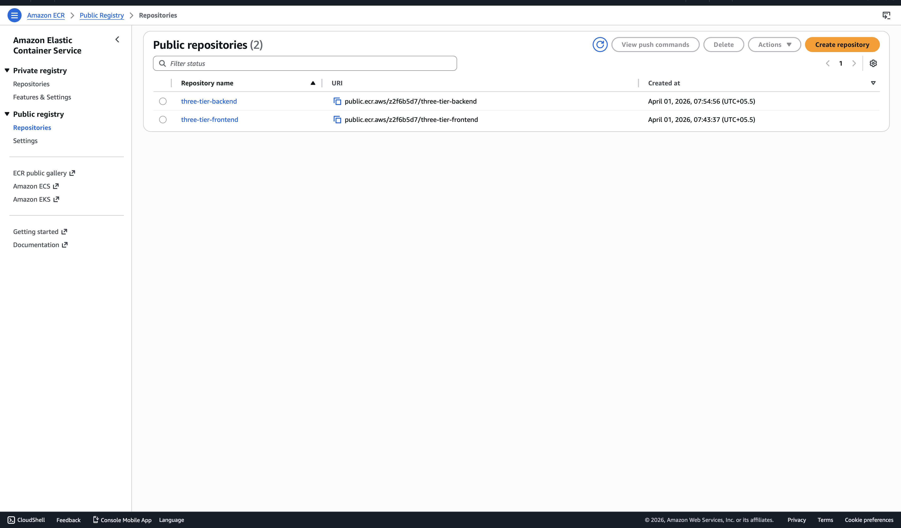

# 🚀 3-Tier Application Deployment on AWS EKS

## 📌 Project Overview

This project demonstrates the deployment of a **3-tier application architecture** using:

* **Frontend:** React
* **Backend:** Node.js
* **Database:** MongoDB
* **Containerization:** Docker
* **Orchestration:** Kubernetes (Amazon EKS)
* **Cloud:** AWS

The application is fully containerized, deployed on Kubernetes, and exposed using an AWS Load Balancer.

---

## 🏗️ Architecture



---

## ⚙️ Tech Stack

* AWS (EKS, ECR, IAM, EC2)
* Docker
* Kubernetes
* Helm
* React.js
* Node.js
* MongoDB

---


## 🚀 Setup & Deployment Steps

### 🔐 Step 1: IAM Configuration

* Create IAM user with AdministratorAccess
* Generate Access Key & Secret Key

---

### 💻 Step 2: Launch EC2

* Launch Ubuntu instance
* SSH into the instance

---

### 🛠️ Step 3: Install AWS CLI

```bash
curl "https://awscli.amazonaws.com/awscli-exe-linux-x86_64.zip" -o "awscliv2.zip"
sudo apt install unzip -y
unzip awscliv2.zip
sudo ./aws/install
aws configure
```

---

### 🐳 Step 4: Install Docker

```bash
sudo apt update
sudo apt install docker.io -y
sudo chown $USER /var/run/docker.sock
docker ps
```

---

### ☸️ Step 5: Install kubectl

```bash
curl -o kubectl https://amazon-eks.s3.us-west-2.amazonaws.com/latest/bin/linux/amd64/kubectl
chmod +x kubectl
sudo mv kubectl /usr/local/bin
kubectl version --client
```

---

### ⚡ Step 6: Install eksctl

```bash
curl --silent --location "https://github.com/weaveworks/eksctl/releases/latest/download/eksctl_$(uname -s)_amd64.tar.gz" | tar xz -C /tmp
sudo mv /tmp/eksctl /usr/local/bin
eksctl version
```

---

### ☁️ Step 7: Create EKS Cluster

```bash
eksctl create cluster --name three-tier-cluster --region us-west-2 --node-type t2.medium --nodes-min 2 --nodes-max 2

aws eks update-kubeconfig --region us-west-2 --name three-tier-cluster

kubectl get nodes
```

---

### 📦 Step 8: Deploy Application

```bash
kubectl create namespace workshop
kubectl apply -f .
```

---

### ⚖️ Step 9: Install AWS Load Balancer Controller

```bash
curl -O https://raw.githubusercontent.com/kubernetes-sigs/aws-load-balancer-controller/v2.5.4/docs/install/iam_policy.json

aws iam create-policy \
--policy-name AWSLoadBalancerControllerIAMPolicy \
--policy-document file://iam_policy.json

eksctl utils associate-iam-oidc-provider \
--region us-west-2 \
--cluster three-tier-cluster \
--approve

eksctl create iamserviceaccount \
--cluster three-tier-cluster \
--namespace kube-system \
--name aws-load-balancer-controller \
--role-name AmazonEKSLoadBalancerControllerRole \
--attach-policy-arn arn:aws:iam::<ACCOUNT_ID>:policy/AWSLoadBalancerControllerIAMPolicy \
--approve \
--region us-west-2
```

---

### 🚀 Step 10: Deploy Load Balancer Controller

```bash
sudo snap install helm --classic

helm repo add eks https://aws.github.io/eks-charts
helm repo update eks

helm install aws-load-balancer-controller eks/aws-load-balancer-controller \
-n kube-system \
--set clusterName=three-tier-cluster \
--set serviceAccount.create=false \
--set serviceAccount.name=aws-load-balancer-controller

kubectl get deployment -n kube-system aws-load-balancer-controller
```

---

### 🌐 Step 11: Apply Ingress

```bash
kubectl apply -f full_stack_lb.yaml
```

---

## ✅ Result

* Fully functional 3-tier application deployed on Kubernetes
* External access via AWS Load Balancer
* Persistent MongoDB storage
* Scalable and production-like setup

---

## 🧹 Cleanup

### Delete EKS Cluster

```bash
eksctl delete cluster --name three-tier-cluster --region us-west-2
```

### Additional Cleanup

* Terminate EC2 instance
* Delete Load Balancer
* Remove unused Security Groups

---

## 📸 Proof of Work

**EKS Cloud Formation / Nodes Running**  



**EKS Ready**  



**3-Tier Application Running**  


**MongoDB Pods Status**  


**Backend Pods Running**  


**Backend & MongoDB**  


**ALB / Load Balancer Running**  


**Frontend Application UI (Port 3000)**  


**Docker Frontend Build**  


**ECR Images Pushed**  


---

## 👨‍💻 Author

**Shivam Dewangan**
DevOps Engineer

---

## ⭐ If you like this project

Give it a ⭐ on GitHub and share with others!
